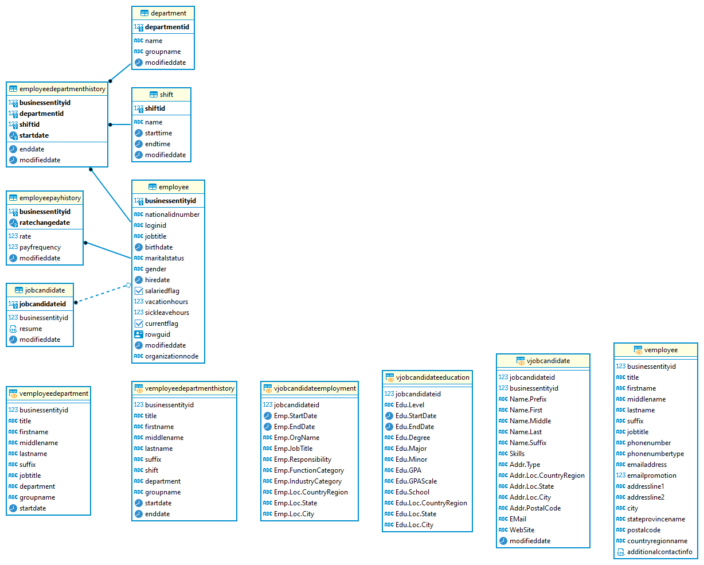
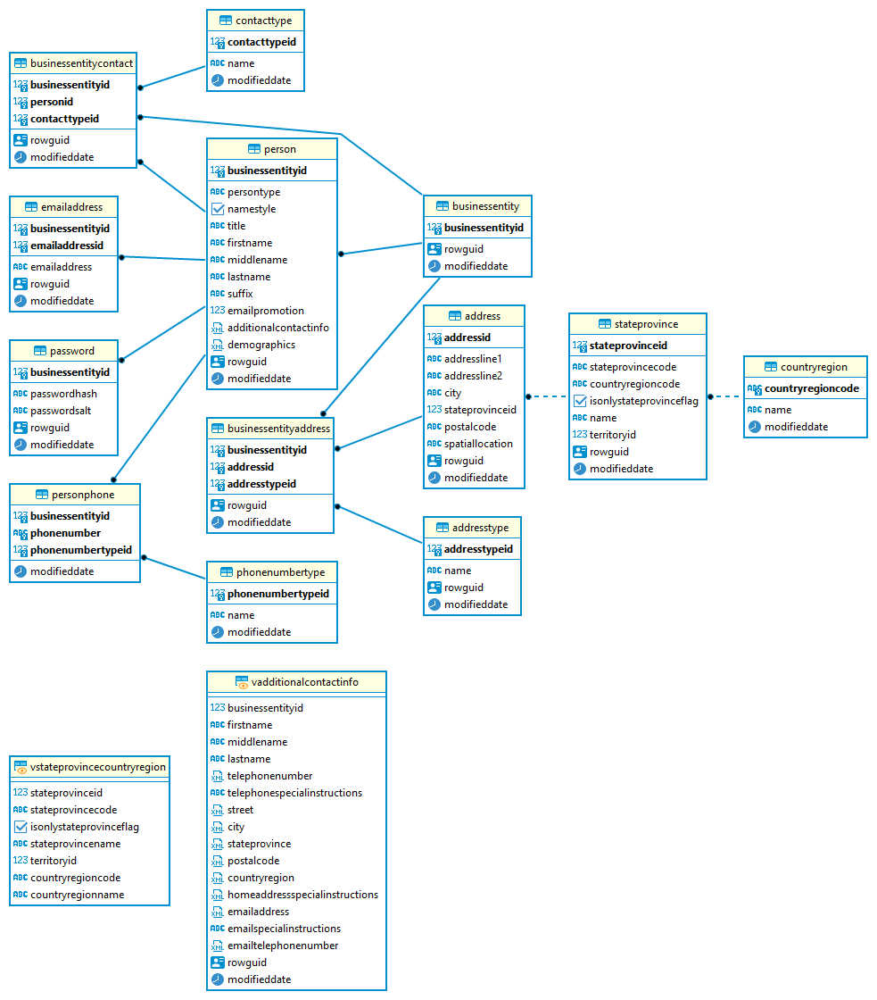
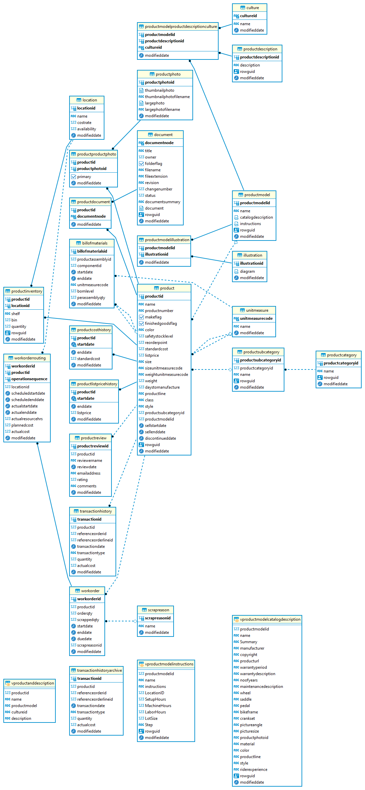
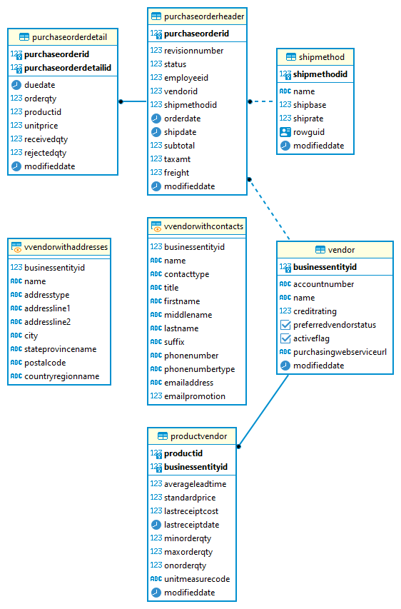
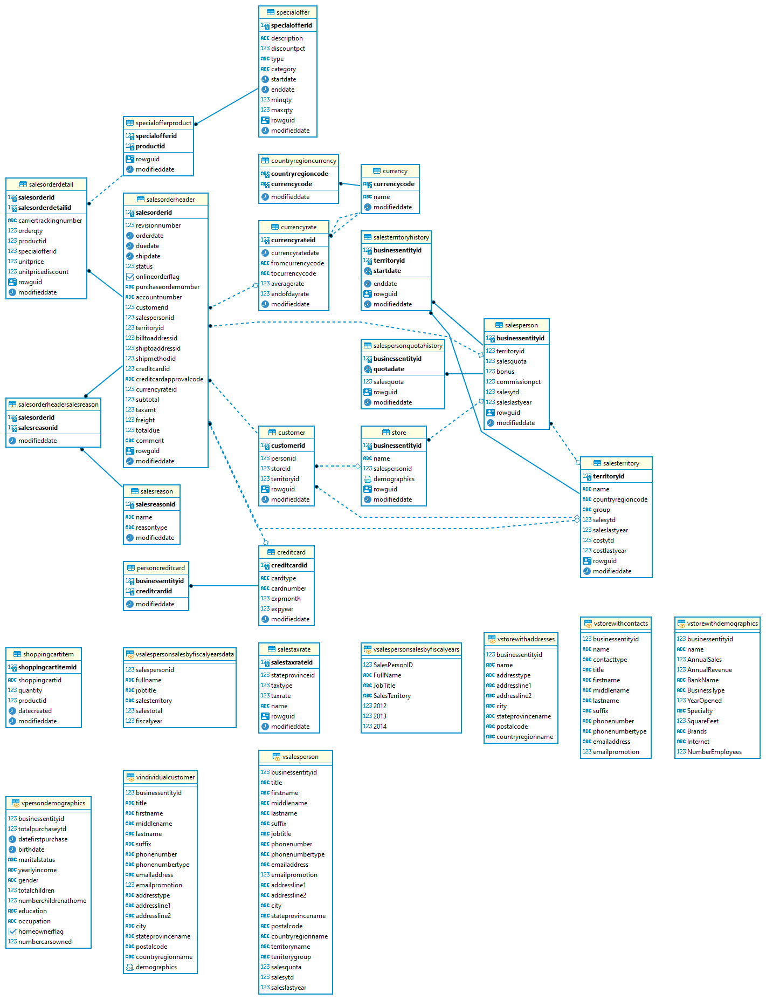

# Analysis of AdventureWorks database in MS SQL

In this repository, I will be analyzing the AdventureWorks demo database for MS SQL. There are over 20 tables in this database which have information on customers, sales, transactions, products, and more. It is a very extensive sample database that is based on a real business.

### Purpose:
The purpose of this project is to understand the AdventureWorks database thoroughly and do simple analysis using complex queries in SSMS. I will be using questions from [W3resource.com](https://www.w3resource.com) which consists of over 100 exploratory data analysis questions to choose from. Below I have included the Entity Relationship Diagram Schema of all tables in the database.

Documentation regarding the AdventureWorks database can be found [here](https://learn.microsoft.com/en-us/sql/samples/adventureworks-install-configure?view=sql-server-ver16&tabs=ssms).

### ERD of Human Resource Schema: 

### ERD of Person Schema:

### ERD of Production Schema:

### ERD of Purchasing Schema:

### ERD of Sales Schema:

