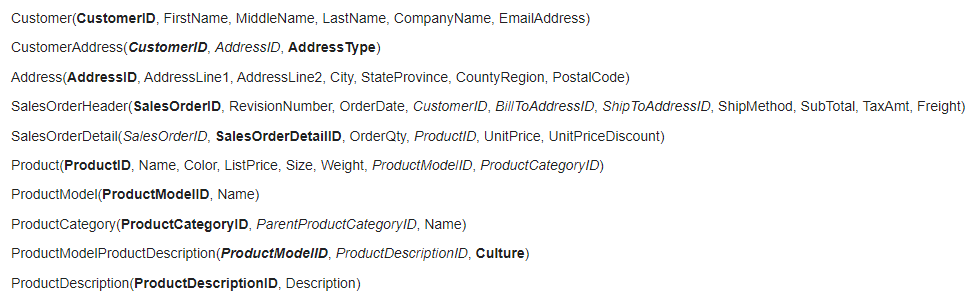
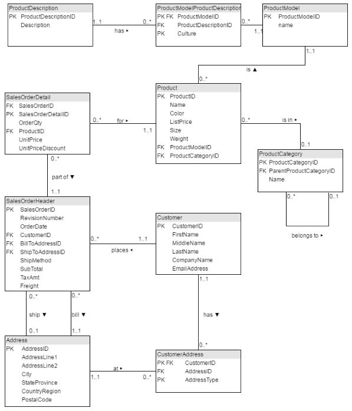

# Analysis of AdventureWorks database in MS SQL

In this repository, I will be analyzing the AdventureWorks demo database for MS SQL. There are over 20 tables in this database which have information on customers, sales, transactions, products, and more. It is a very extensive sample database that is based on a real business. This database can be downloaded from Microsoft's website, but I will provide the version I used in this repository.

### Purpose:
The purpose of this project is to understand the AdventureWorks database thoroughly and do simple analysis using complex queries in SSMS. I will be using questions from [SQLZOO.net](https://sqlzoo.net) which consists of exploratory analysis questions ranging from easy to hard. I have included a backup of the database in this repository and below I will show the tables I will be using as well as the schema of those tables.

Documentation regarding the AdventureWorks database can be found [here](https://learn.microsoft.com/en-us/sql/samples/adventureworks-install-configure?view=sql-server-ver16&tabs=ssms).

### Tables: 

### Schema:

